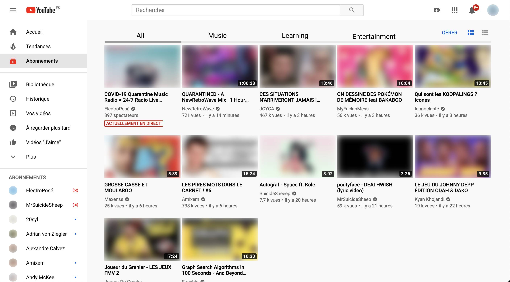

# Yousortube

Behind this brilliant and long-sought name is a pretty simple web app to provide a single feature: **group your Youtube subscriptions into custom categories.**

Image if you could have those nice tabs on the Youtube page:

This is what I'm aiming to do with my app :)

---------

No need to connect to your Google account in this app, everydata we use is already public!

But an account is necessary if you want to save your setup and share it across multiple platforms. (The registration is really fast, don't worry).

# Api

This Api part is build with [NestJS](https://nestjs.com/) because I like this framework. It's powerful.

You'll be able to separate the Youtube channels your are subscribed to into different tabs. This way, you can keep your subscriptions flow clear!

# Available endpoints:

// TODO List them all.

## Authentication flow

We use a simple OAuth authentication flow, using jwt tokens.

### Registration

First, you'll need to sign up. We only need a login and a password.

> POST /users
> body: { "username": "mooncake", "password": "chewkiti" }

*(Don't use that password, it's so unsecured)*

We'll return your brand new user with its `id`. But you're **not authenticated**.

### Login

Then, you can log in:

> POST /auth/login { "username": "mooncake", "password": "chewkiti" }

You'll get a jwt token. You must provide it for every requests requiring authentication in a HTTP header: `Authorization: Bearer <my-jwt-token>`

### My jwt token expired

First solution: **login again**.

or

Second solution: **use refresh token**.  
When you log in, we set an Http only cookie with a usable refresh token.

Just call this endpoint to get a fresh new jwt token (with the cookie, obviously):

> GET /auth/refresh-token

You'll get a new jwt token *or* a 403 error, meaning that the refresh token expired. In that case, you have to login again.

## Subscriptions management

### Indicate your subscriptions

In order to make the app work, it has to know what are your current subscriptions.

We use the youtube OPML file (that describe RSS flux) to get this information.

> You can find your own opml file at the bottom of the page `https://www.youtube.com/subscription_manager`.

To upload your OPML file, use this endpoint:

> POST /users/opml
> body: { file: \<encoded_binary_file> }

You'll get a response showing your first subscription group! It includes all the subscriptions you currently have.

### Get all subscriptions

// TODO

### Create a new group

To create a new subscription group, just call:

> POST /subscription-groups
> body: { "groupTitle": "\<group_name>", "channelIds": ["channel_id_1", "channel_id_2"] }

And boom! Your group is created!

### Get videos from a group

To get the last videos of the subscription group, just like the global youtube subscription page, call:

> GET /subscription-groups/:id/videos

And we'll respond with the informations of the last videos included in that group, including the thumbnails.